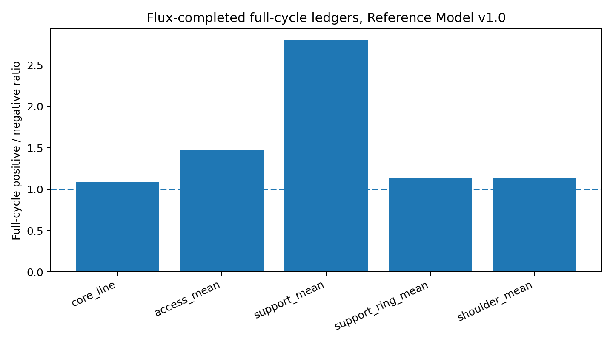
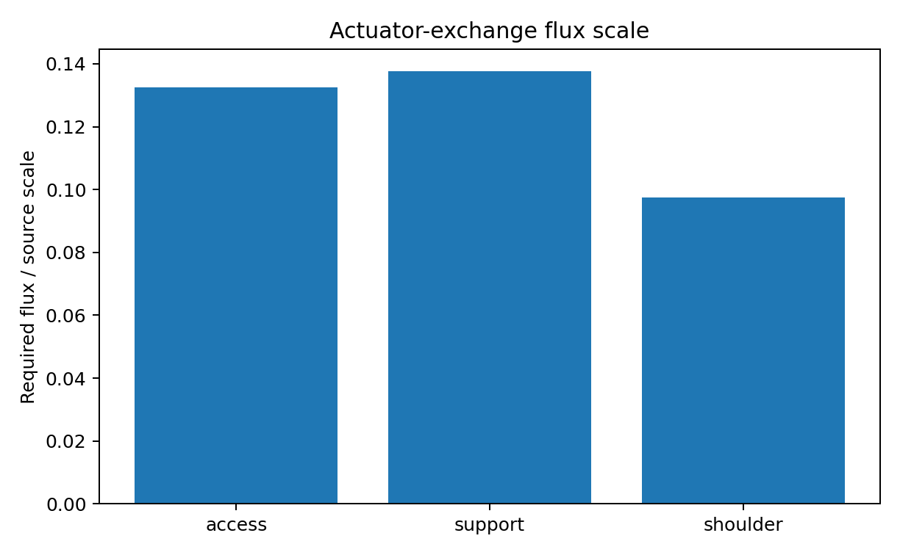
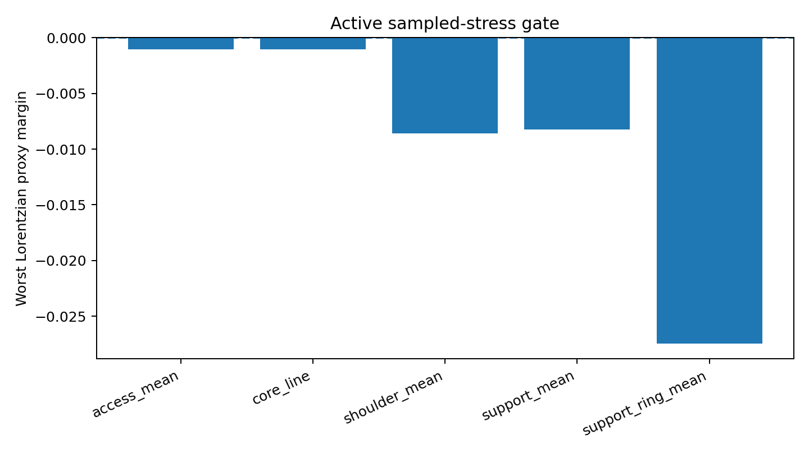

# Hybrid Flare-Gated Reduced Reference Model v1.0

## Executive summary

This report freezes the **Hybrid Flare-Gated Reduced Reference Model v1.0**. The model combines the frozen **Reference Geometry v0.3** with the leading **Hybrid Source Architecture v0.3** and a reduced anisotropic **actuator-exchange closure**. It is a complete reduced engineering reference model for the current phase of work.

The model lifecycle is

```math
\text{flattened }R\text{ standby}
\rightarrow B\text{ prestretch}
\rightarrow R\text{ flare opening}
\rightarrow \text{quiet access hold}
\rightarrow R\text{ closure}
\rightarrow \text{hybrid repayment / shoulder matching}
\rightarrow B\text{ reset}.
```

The source architecture is

```math
T_{\mu\nu}^{\rm total}
=
T_{\mu\nu}^{\rm NMC\ support}
+
T_{\mu\nu}^{\rm infrastructure\ repayment}
+
T_{\mu\nu}^{\rm shoulder/matching}.
```

The closure ansatz embeds the source components as a reduced anisotropic tensor with conservation-completing radial flux. The flux-completed ledgers close across the full lifecycle for the core, access, support, support-ring, and shoulder observer families. The conservation residual is small in the reduced embedding:

```math
\max |\mathrm{residual}|/\max|T_{kk}| \simeq 5.701\times 10^{-4}.
```

The model is an **engineering-closed reduced reference model**. The quantum-field-theoretic admissibility gate remains active. The Lorentzian sampled-stress proxy reports negative margins for medium and long sampling windows, so the report treats v1.0 as a frozen reduced target for quantum-source analysis rather than a completed physical source construction.

## 1. Why this model exists

The work started with an adiabatic radial-stretch idea: use $B(l,t)$ to prepare a long proper-radial throat, hold a quiet access interval, and reset slowly. That first design cleanly reduced peak dynamic rates, fluxes, and acceleration proxies. Full source-history screening then showed that pure $B$-adiabaticity carried a persistent negative null-history ledger through setup and reset.

The design then moved to a coupled $B,R$ protocol. The areal-radius profile $R(l,t)$ became a flare/access-state actuator: a flattened standby state carries setup/reset while the access flare is closed, and the flared access geometry is restored only after the support geometry is prestretched. This produced the core design rule:

```math
B \text{ dilutes support},\qquad
R \text{ gates flare/access state},\qquad
N \text{ shapes timing and matching}.
```

The next stage added explicit compensation and shoulder/lapse shaping. That created a balanced open-interval repayment ledger while keeping compensation isolated from the access observer family. Source-realism screening then identified setup/reset support-ring and shoulder ledgers. Candidate-source screens demoted the single-source interpretation and promoted a hybrid architecture: nonminimally coupled-scalar-like support for the core/access role, with infrastructure repayment and shoulder/matching components carrying the phase-structured residual.

This v1.0 report freezes the first reduced model in which those pieces are combined, flux-completed, and ledgers are rechecked over the full lifecycle.

## 2. Literature setting

Traversable wormhole engineering begins from the Morris--Thorne throat picture: a usable throat requires flare-out and traversability conditions, and flare-out is tied to exotic/null-energy-violating support [MorrisThorne1988]. Ford and Roman's quantum-inequality analysis places severe magnitude-duration constraints on negative energy in static traversable wormhole geometries; their conclusion drives macroscopic support toward Planck-scale or length-scale-discrepancy regimes [FordRoman1996]. Quantum-interest results make repayment a timed source-history problem: a negative-energy pulse requires positive overcompensation with restrictions that depend on separation and amplitude [FordRoman1999].

Fewster and Roman's null-contracted sampling method is especially close to the screen used here. Their work studies $T_{\mu\nu}k^\mu k^\nu$ averaged over timelike worldlines and constrains small-exotic-matter wormhole proposals [FewsterRoman2005]. Dynamic throat work by Hochberg and Visser shows that energy-condition pressure remains a local throat issue for time-dependent wormholes [HochbergVisser1998]. Nonminimally coupled scalar work by Barceló and Visser supplies the strongest GR-adjacent classical source motivation in this work: positive curvature coupling can violate the standard energy conditions, including ANEC, and supports wormhole-motivated solution branches [BarceloVisser2000]. Gao--Jafferis--Wall provides a modern benchmark for controlled traversability from a specific quantum/holographic mechanism, where boundary coupling produces negative averaged null energy and renders an Einstein--Rosen bridge traversable [GaoJafferisWall2017].

The contribution here is an engineering reduction: it turns the source problem into a phase-structured, observer-family-specific target. The model supplies a frozen source target for the next quantum-source admissibility phase.

## 3. Frozen geometry

The frozen geometry is Reference Geometry v0.3 in the spherically symmetric metric family

```math
ds^2=-N(l,t)^2dt^2+B(l,t)^2dl^2+R(l,t)^2d\Omega^2.
```

The canonical parameters are

| Parameter | Value |
|---|---:|
| $B_0$ | 8 |
| $w_B$ | 10 |
| $T_B$ | 150 |
| $T_R$ | 5 |
| $T_H$ | 60 |
| $T_C$ | 20 |
| access compensation support amplitude | 0.0082 |
| access compensation shoulder amplitude | 0.0019 |
| shoulder center | 2.3 |
| shoulder width | 1.0 |
| shoulder lapse amplitude | -0.18 |

The geometry role allocation is:

| Control | Role |
|---|---|
| $B(l,t)$ | radial support dilution and proper-length infrastructure |
| $R(l,t)$ | flare/access-state gating |
| $N(l,t)$ | timing, shoulder matching, redshift shaping |
| support-ring/shoulder windows | repayment and buffer containment |

The frozen geometry keeps the access interval quiet while allowing support preparation, flare opening, closure, repayment, and reset to happen in separate operational phases.

## 4. Source architecture

The source architecture is hybrid:

1. **NMC-like support component.** This component carries the open-interval core/access exotic-support role. Earlier single-source fits showed strong core/access matching and weak global matching. Component separation then localized the NMC-like component to the support role.
2. **Infrastructure repayment component.** This component carries setup/reset support-ring and residual repayment.
3. **Shoulder/matching component.** This component shapes the buffer, matches the lapse/shoulder region, and supplies shoulder repayment.

The strict-pass setup/reset infrastructure amplitudes used in the closure are

| Source amplitude | Value |
|---|---:|
| $A_{\rm support,set/reset}$ | 0.022 |
| $A_{\rm shoulder,set/reset}$ | 0.016 |

The support amplitude closes the support-ring ledger after flux completion. The shoulder amplitude restores the shoulder full-cycle ratio above unity after flux completion. The support mean ledger carries margin, which is acceptable in the strict reference and becomes a shaping target for future source polishing.

## 5. Closure ansatz

The closure screen embeds the phase-structured source target in a reduced anisotropic stress tensor:

```math
T^\mu{}_\nu = \mathrm{diag}(-\rho,p_r,p_t,p_t) + T^t{}_l.
```

For each null-contracted source target, the reduced embedding uses

```math
\rho=\frac12 T_{kk},\qquad p_r=\frac12 T_{kk},\qquad p_t=0,
```

with conservation-completing radial flux $f=T_{\hat t\hat l}$ satisfying the reduced continuity equation

```math
\partial_t\rho+
\frac{1}{BR^2}\partial_l(NR^2 f)\approx 0.
```

The closure is therefore an **actuator-exchange closure**. It supplies a bounded radial transport channel for the engineered infrastructure source rather than representing a passive single-field source. This is the proper engineering interpretation of the current stage.

## 6. Flux-completed full-cycle ledgers

The strict readout uses

```math
T_{kk,\min}=T_{kk}-2|f|,
```

which accounts for the fact that radial flux improves one null direction while worsening the other. The flux-completed full-cycle positive-to-negative ratios are:

| Observer family | Flux-completed full positive/negative ratio |
|---|---:|
| core line | 1.083 |
| access mean | 1.471 |
| support mean | 2.801 |
| support ring mean | 1.135 |
| shoulder mean | 1.130 |

All five primary observer-family ledgers clear unity after flux completion.



## 7. Conservation and actuator-exchange readout

The required radial flux is bounded relative to the source scale:

| Zone | Required flux / source scale |
|---|---:|
| access | 0.132 |
| support | 0.138 |
| shoulder | 0.097 |

The global flux-completed residual is

```math
\max |\mathrm{residual}|/\max|T_{kk}|
= 5.701\times 10^{-4}.
```



This readout supports the v1.0 freeze as a reduced actuator-exchange model. The source has a clear engineering meaning: transport/exchange is present, bounded, and assigned to the infrastructure source rather than hidden inside a passive exotic-fluid label.

## 8. Lorentzian sampled-stress gate

The active physics gate is the Lorentzian sampled-stress proxy. The screen uses a quantum-inequality-style reference of the form

```math
\langle T_{kk}\rangle_\tau \gtrsim -\frac{C}{\tau^4},
\qquad
C=\frac{3}{32\pi^2}.
```

The flux-completed source still has negative margins. The worst margins are:

| Observer family | Worst proxy margin | Window $\tau$ | Center |
|---|---:|---:|---:|
| core line | -1.062e-03 | 5.0 | 177.06 |
| access mean | -1.032e-03 | 5.0 | 177.06 |
| support mean | -8.215e-03 | 2.0 | 8.58 |
| support ring mean | -2.746e-02 | 2.0 | 8.58 |
| shoulder mean | -8.607e-03 | 2.0 | 8.58 |



This result defines the next major physics phase. The model is a reduced engineering closure. Quantum-source admissibility, quantum-interest timing, NMC scalar field-equation closure, and backreaction/stability are the next gates.

## 9. What the work says beyond the literature

The literature already supplies the broad constraint map: traversable throats require null-energy violation; quantum inequalities constrain magnitude and duration; repayment has timing and overcompensation structure; dynamic throats retain local energy-condition pressure; nonminimally coupled scalars are plausible exotic-support candidates under strong conditions.

The present work adds an engineering decomposition:

```math
\text{geometry control}
\rightarrow
\text{observer-family ledger}
\rightarrow
\text{source role}
\rightarrow
\text{closure check}.
```

The main design-level findings are:

1. **Adiabatic $B$-stretch is a support-dilution actuator.** It reduces peak dynamic rates and local support severity while source-history screening assigns the long-duration ledger to later gates.
2. **$R$-flare gating creates the access-state control.** Flattening/restoring flare curvature separates setup/reset from the access flare and avoids continuous access-core breathing.
3. **$N$-shoulder shaping provides the timing/matching container.** It supports repayment isolation and shoulder containment.
4. **Single-source fitting is weaker than role-separated source architecture.** The NMC-like component fits core/access support while infrastructure components carry setup/reset and shoulder ledgers.
5. **Flux-completed anisotropic closure is available as a reduced engineering closure.** It converts the ledger overlay into a source with bounded radial exchange and small residual.

These are engineering-methods results. They define the quantum-source target precisely.

## 10. Freeze statement

The frozen model is:

```math
\boxed{\text{Hybrid Flare-Gated Reduced Reference Model v1.0}}
```

with the following status:

| Gate | Status |
|---|---|
| Geometry lifecycle | frozen as Reference Geometry v0.3 |
| Source architecture | frozen as Hybrid Source Architecture v0.3 |
| Component separation | NMC support + infrastructure repayment + shoulder/matching |
| Flux-completed ledgers | full-cycle ratios above unity for primary observer families |
| Reduced conservation | small residual with bounded actuator-exchange flux |
| Access isolation | preserved in the reduced screens |
| Lorentzian sampled-stress proxy | active physics gate with negative margins |
| Physical source construction | next phase |
| Backreaction/stability | next phase |

## 11. Next phase

The next phase is **quantum-source admissibility** for the frozen v1.0 target. It should evaluate:

1. field-equation closure for the NMC-like support component;
2. actuator-exchange interpretation for infrastructure repayment;
3. source-specific quantum inequalities rather than the generic Lorentzian proxy alone;
4. quantum-interest timing for each negative/positive source pair;
5. perturbative backreaction and ringing across the flare-open/close cycle;
6. repeated-operation accumulation in the support-ring and shoulder components.

The v1.0 model supplies the frozen target for that phase.

## References

- [MorrisThorne1988] M. S. Morris and K. S. Thorne, “Wormholes in spacetime and their use for interstellar travel: A tool for teaching general relativity,” *American Journal of Physics* 56, 395--412 (1988). DOI: 10.1119/1.15620.
- [FordRoman1996] L. H. Ford and T. A. Roman, “Quantum field theory constrains traversable wormhole geometries,” *Physical Review D* 53, 5496--5507 (1996). DOI: 10.1103/PhysRevD.53.5496.
- [FordRoman1999] L. H. Ford and T. A. Roman, “The quantum interest conjecture,” *Physical Review D* 60, 104018 (1999). DOI: 10.1103/PhysRevD.60.104018.
- [FewsterRoman2005] C. J. Fewster and T. A. Roman, “On wormholes with arbitrarily small quantities of exotic matter,” *Physical Review D* 72, 044023 (2005). DOI: 10.1103/PhysRevD.72.044023.
- [HochbergVisser1998] D. Hochberg and M. Visser, “The Null Energy Condition in Dynamic Wormholes,” *Physical Review Letters* 81, 746--749 (1998). DOI: 10.1103/PhysRevLett.81.746.
- [BarceloVisser2000] C. Barceló and M. Visser, “Scalar fields, energy conditions, and traversable wormholes,” *Classical and Quantum Gravity* 17, 3843--3864 (2000). DOI: 10.1088/0264-9381/17/18/318.
- [GaoJafferisWall2017] P. Gao, D. L. Jafferis, and A. C. Wall, “Traversable wormholes via a double trace deformation,” *Journal of High Energy Physics* 2017, 151 (2017). DOI: 10.1007/JHEP12(2017)151.
