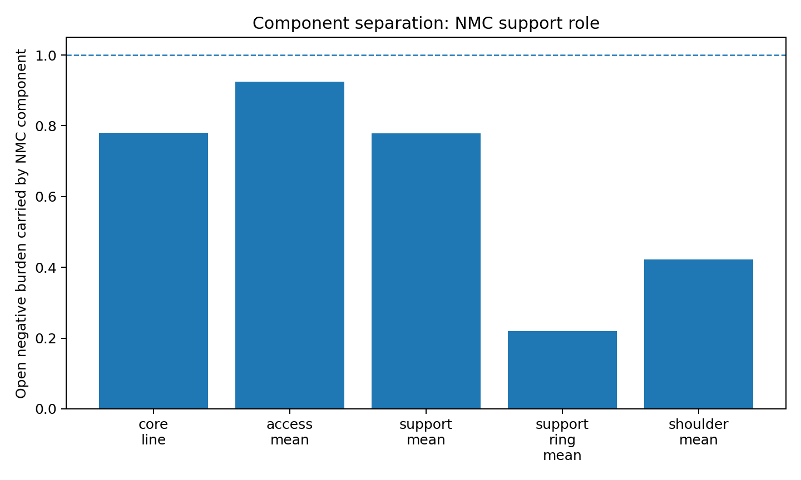
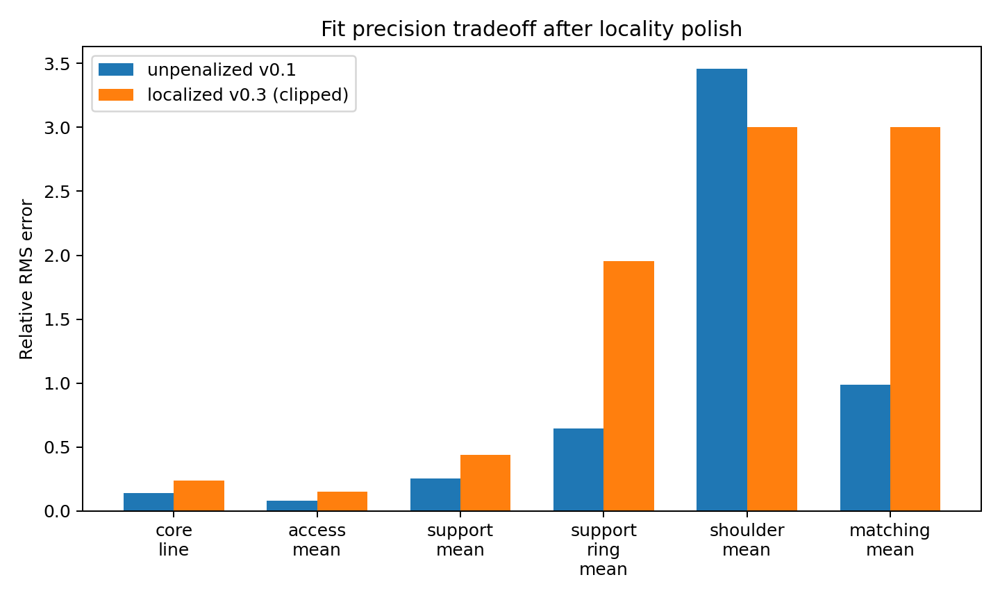
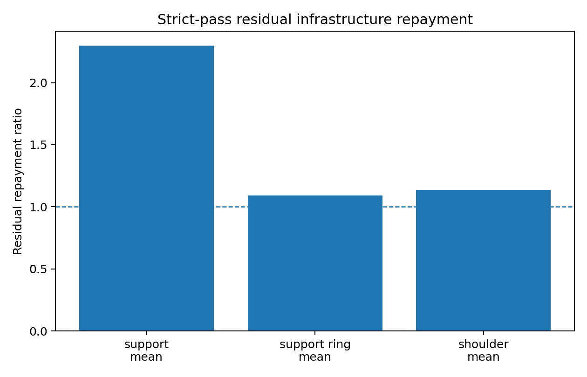
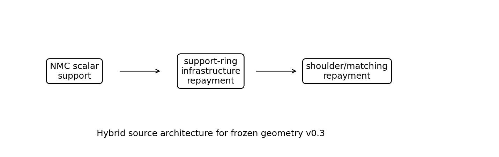

# Candidate Source Model v0.3: Hybrid NMC Support and Infrastructure Repayment Component Separation

## Executive summary

This report records the third candidate-source screen for the frozen Reference Geometry v0.3. The screen advances the source program from a single-source fit toward a component-separated architecture:

\[
T_{\mu\nu}^{\rm total}
=
T_{\mu\nu}^{\rm NMC\ support}
+
T_{\mu\nu}^{\rm support\text{-}ring/infrastructure\ repayment}
+
T_{\mu\nu}^{\rm shoulder/matching}.
\]

The result is constructive. The nonminimally coupled (NMC) scalar channel supplies a strong source candidate for the core/access/support role during the open interval. The infrastructure source supplies the residual support-ring and shoulder repayment ledgers. The component separation screen assigns each source component to a subsystem role and keeps the frozen geometry v0.3 intact.

The locality-polished NMC support component carries the open-interval core, access, and broad support burden with controlled spillover into ring and shoulder sectors. The strict-pass infrastructure repayment variant closes the residual support-ring and shoulder ledgers. The leading architecture is therefore a hybrid source model rather than a single-field source model.

## 1. Context and lineage

### 1.1 Frozen geometry context

Reference Geometry v0.3 is the canonical geometry-control lifecycle:

\[
\text{flattened }R\text{ standby}
\rightarrow
B\text{ prestretch}
\rightarrow
R\text{ flare opening}
\rightarrow
\text{quiet access hold}
\rightarrow
R\text{ closure}
\rightarrow
\text{balanced compensation with }N\text{ shaping}
\rightarrow
B\text{ reset}.
\]

The geometry screen assigned the main functions as follows:

| Function | Geometry/source assignment |
|---|---|
| Radial support dilution | \(B(l,t)\) |
| Flare/access-state gating | \(R(l,t)\) |
| Timing and shoulder matching | \(N(l,t)\) |
| Positive repayment ledger | explicit source target |
| Buffer and transition containment | support-ring and shoulder sectors |

The source-realism screens then reconstructed the required source ledger for the full lifecycle and identified two active source tasks: the post-closure repayment overlay needed a stress-tensor embedding, and the setup/reset support-shoulder history needed infrastructure repayment.

### 1.2 Candidate-source lineage

The source program advanced through three screens.

**Candidate Source Model v0.1** used a reduced NMC scalar second-derivative channel. It showed strong shape compatibility in core/access sectors and weak global compatibility across the full infrastructure ledger.

**Candidate Source Model v0.2** used the fuller null-contracted NMC scalar expression,

\[
T_{kk}^{\rm NMC}
=
(k\phi)^2
+
\xi\left(G_{kk}\phi^2-k^\mu k^\nu\nabla_\mu\nabla_\nu(\phi^2)\right),
\]

and found the same structural result with greater clarity: the NMC scalar branch fits the core/access source role better than the global support-ring/shoulder repayment role.

**Candidate Source Model v0.3** is the component separation screen documented here. It fits the NMC-like component to the open-interval support target, applies locality penalties to preserve subsystem role separation, and assigns residual repayment to support-ring and shoulder infrastructure sources.

## 2. Literature placement

Traversable wormhole source realism begins with the Morris-Thorne flare-out requirement, where traversability requires radial null-energy-condition violation near the throat [MorrisThorne1988]. Ford and Roman then showed that quantum field theory places strong restrictions on static macroscopic wormhole geometries through quantum inequalities [FordRoman1996]. Their quantum-interest work further frames negative and positive energy phases as a timed repayment problem, with overcompensation and separation constraints [FordRoman1999].

The Visser-Kar-Dadhich line of work showed that volume-integral measures of energy-condition violation can be reduced in special wormhole geometries [VisserKarDadhich2003]. Fewster and Roman then sharpened the source gate by applying null-contracted quantum inequality reasoning to such small-exotic-matter models [FewsterRoman2005]. The current source program uses this lesson directly: integrated ledgers are useful engineering diagnostics, while null-contracted sampling remains the decisive source-realism screen.

Dynamic throat work by Hochberg and Visser emphasizes local null-expansion diagnostics and the persistence of energy-condition pressure in dynamic throat settings [HochbergVisser1998]. Kuhfittig's Ford-Roman-compatible static/dynamic geometries reinforce the same source burden at the engineering level [Kuhfittig2002]. The v0.3 geometry therefore keeps the access hold quiet and assigns dynamic activity to controlled open/close, setup/reset, and shoulder phases.

Nonminimally coupled scalar fields are the leading GR-adjacent physical-source branch in this screen. Barceló and Visser showed that nonminimally coupled scalar fields can violate standard energy conditions, including averaged conditions, and can support traversable-wormhole branches under appropriate conditions [BarceloVisser2000]. This motivates the NMC scalar as a serious support component, while the current screen assigns infrastructure repayment to separate effective-source channels. Gao-Jafferis-Wall remains an important modern benchmark for controlled negative averaged null energy in a holographic setting [GaoJafferisWall2017]; it supports the general source-scheduling perspective while belonging to a specialized theoretical setting.

## 3. Frozen geometry and source target

The frozen geometry uses the spherically symmetric family

\[
ds^2=-N(l,t)^2dt^2+B(l,t)^2dl^2+R(l,t)^2d\Omega^2.
\]

The source target is the required effective null-contracted source history plus repayment overlays already screened in source-realism v0.2. The observer families are:

| Observer family | Role |
|---|---|
| core line | throat center support history |
| access mean | protected access-region average |
| support mean | broad support-region average |
| support ring mean | infrastructure ring around the access support region |
| shoulder mean | transition/buffer/matching sector |
| matching mean | outer matching monitor |

The target source ledger contains an open-interval exotic support burden, setup/reset infrastructure burden, and positive repayment phases. Candidate Source Model v0.3 splits those roles between an NMC-like support component and an infrastructure repayment component.

## 4. Method

### 4.1 NMC support-component fit

The NMC-like support component is fit to the localized open-interval support target. The reduced feature set uses smooth phase and radial profiles derived from the NMC scalar null-stress channel. The fit is penalized for shoulder and support-ring activity to encourage a role-pure component:

\[
\mathcal{L}
=
E_{\rm core}+E_{\rm access}+E_{\rm support}
+
\lambda_{\rm ring}A_{\rm ring}^{\rm NMC}
+
\lambda_{\rm sh}A_{\rm shoulder}^{\rm NMC}.
\]

The selected locality-polished case uses the NMC-like component as the core/access/support source and leaves ring/shoulder repayment to infrastructure.

### 4.2 Residual infrastructure repayment fit

After subtracting the NMC support component, the remaining residual is fitted with support-ring and shoulder repayment pulses. The strict-pass variant uses:

\[
A_{\rm support,set/reset}=0.022,
\qquad
A_{\rm shoulder,set/reset}=0.011,
\qquad
A_{\rm open,ring}=0.
\]

This variant closes the support-ring and shoulder residual ledgers while keeping repayment activity assigned to the infrastructure subsystem.

### 4.3 Data products

The main output tables are:

| File | Role |
|---|---|
| `candidate_source_model_v03_fit_metrics.csv` | NMC fit metrics by observer family |
| `candidate_source_model_v03_observer_ledgers.csv` | phase-wise ledger decomposition by source component |
| `candidate_source_model_v03_locality_sweep.csv` | locality-penalty sweep |
| `candidate_source_model_v03_recommended_strict_pass.csv` | selected strict-pass infrastructure repayment variant |
| `candidate_source_model_v03_polish_summary.json` | compact summary of selected cases |

## 5. Results

### 5.1 NMC support component after locality polish

The selected locality-polished split carries the open-interval burden as follows:

| Observer family | Open burden carried by NMC |
|---|---:|
| core line | 0.781 |
| access mean | 0.924 |
| support mean | 0.779 |
| support ring mean | 0.220 |
| shoulder mean | 0.422 |

This is the desired role separation. The NMC-like support component carries the protected access and broad support regions, while the support-ring and shoulder sectors retain residual ledgers for the infrastructure source.

### 5.2 Fit precision tradeoff

The locality-polished fit trades some core/support precision for cleaner subsystem separation. The comparison against the previous unpenalized component-separation fit is:

| Observer | unpenalized v0.1 rel. error | localized v0.3 rel. error | unpenalized v0.1 corr. | localized v0.3 corr. |
|---|---:|---:|---:|---:|
| core line | 0.143 | 0.238 | 0.999 | 0.988 |
| access mean | 0.083 | 0.153 | 0.997 | 0.988 |
| support mean | 0.256 | 0.440 | 0.980 | 0.900 |
| support ring mean | 0.646 | 1.956 | 0.813 | 0.154 |

The polished architecture values subsystem clarity. The core and access fits remain strong, and the ring/shoulder residual becomes the infrastructure source's assignment.

### 5.3 Phase-wise ledger decomposition

The NMC component carries the open support role. The residual infrastructure source carries setup/reset and support-ring/shoulder repayment. Key ledger fractions are:

| Observer family | Open negative fraction carried by NMC | Open residual negative fraction | Setup/reset negative fraction in NMC |
|---|---:|---:|---:|
| core line | 0.781 | 0.221 | 0.000 |
| access mean | 0.924 | 0.080 | 0.000 |
| support mean | 0.779 | 0.269 | 0.089 |
| support ring mean | 0.220 | 1.554 | 0.098 |
| shoulder mean | 0.422 | 0.857 | 0.081 |

The setup/reset fractions show that the infrastructure source is the natural carrier for the long support-ring and shoulder histories.

### 5.4 Strict-pass residual repayment

The strict-pass infrastructure variant closes the residual ledgers:

| Residual ledger | Ratio |
|---|---:|
| support mean | 2.299 |
| support ring mean | 1.091 |
| shoulder mean | 1.137 |

The strict-pass variant supplies extra broad-support margin while bringing the support ring and shoulder above unity. This is a useful source-engineering reference point. A later source-shaping pass can redistribute the broad-support excess while preserving ring and shoulder closure.

### 5.5 Architecture summary

The leading source architecture is:

| Component | Role |
|---|---|
| NMC scalar-like support | core/access/open support burden |
| support-ring infrastructure source | setup/reset and residual ring repayment |
| shoulder/matching infrastructure source | buffer, shoulder repayment, matching container |
| lapse/shoulder geometry | timing, redshift, matching, isolation |

## 6. Interpretation

The v0.3 component separation screen gives a mature source architecture for the frozen geometry. The NMC scalar branch remains the strongest literature-supported GR-adjacent support component. The infrastructure repayment component becomes the clean source assignment for support-ring and shoulder ledgers.

The central design statement is:

\[
\boxed{
\text{NMC scalar-like support carries the access/support role, and infrastructure repayment carries the ring/shoulder source-history role.}
}
\]

This result aligns with the earlier geometry framework. Each subsystem receives the source component suited to its role:

| Framework role | v0.3 source assignment |
|---|---|
| support | NMC scalar-like component |
| access | protected observer family, low direct repayment exposure |
| repayment | infrastructure pulses after source decomposition |
| buffer | shoulder/matching component |
| matching | lapse-shaped shoulder container |
| transition | support-ring and shoulder source windows |
| source realism | hybrid candidate-source architecture |

## 7. Limits and active gates

The screen is a reduced source-compatibility screen. It provides a component architecture and target ledgers. The next gates are:

1. **Full stress-tensor embedding.** Promote the component fits into \(\rho,p_r,p_t,f\) with small conservation residuals or explicit actuator exchange.
2. **Scalar-field reconstruction.** Fit an actual scalar field \(\phi(l,t)\), coupling \(\xi\), and potential or effective interaction terms for the NMC support component.
3. **Sampling and quantum-interest tests.** Apply sampled null-contracted stress screens to the fitted tensor, including delay and overcompensation constraints.
4. **Backreaction.** Replace prescribed-geometry source fitting with a self-consistency loop.
5. **Infrastructure-source interpretation.** Identify whether the support-ring and shoulder repayment source is best modeled as an effective fluid, boundary/actuator channel, or a controlled quantum-state branch.

## 8. Recommended next phase

The next phase should be:

\[
\boxed{\text{hybrid source architecture v0.1 stress-tensor embedding}.}
\]

It should build a full effective tensor for each component:

\[
T_{\mu\nu}^{\rm hybrid}
=
T_{\mu\nu}^{\rm NMC\ support}
+
T_{\mu\nu}^{\rm ring\ repayment}
+
T_{\mu\nu}^{\rm shoulder/matching},
\]

and evaluate:

| Diagnostic | Target |
|---|---|
| conservation residual | minimized or assigned to actuator exchange |
| sampled \(T_{kk}\) | improved over overlay ledger |
| quantum-interest timing | explicit negative/positive phase relation |
| access leakage | remains small |
| support-ring closure | remains above unity |
| shoulder closure | remains above unity |

## 9. Conclusion

Candidate Source Model v0.3 advances the source-realism program from a single-source scalar test to a component-separated hybrid architecture. The NMC scalar-like component supplies the core/access/support role. The support-ring and shoulder infrastructure sources supply residual repayment and matching. The strict-pass variant closes the residual ring and shoulder ledgers.

The source program is now positioned for stress-tensor embedding. The frozen geometry remains the canonical access architecture, and the leading source model is a hybrid NMC-support plus infrastructure-repayment architecture.

## References

- [MorrisThorne1988] M. S. Morris and K. S. Thorne, “Wormholes in spacetime and their use for interstellar travel: A tool for teaching general relativity,” *American Journal of Physics* 56, 395–412 (1988). DOI: 10.1119/1.15620.
- [FordRoman1996] L. H. Ford and T. A. Roman, “Quantum field theory constrains traversable wormhole geometries,” *Physical Review D* 53, 5496–5507 (1996). DOI: 10.1103/PhysRevD.53.5496.
- [FordRoman1999] L. H. Ford and T. A. Roman, “The quantum interest conjecture,” *Physical Review D* 60, 104018 (1999). DOI: 10.1103/PhysRevD.60.104018.
- [VisserKarDadhich2003] M. Visser, S. Kar, and N. Dadhich, “Traversable Wormholes with Arbitrarily Small Energy Condition Violations,” *Physical Review Letters* 90, 201102 (2003). DOI: 10.1103/PhysRevLett.90.201102.
- [FewsterRoman2005] C. J. Fewster and T. A. Roman, “On wormholes with arbitrarily small quantities of exotic matter,” *Physical Review D* 72, 044023 (2005). DOI: 10.1103/PhysRevD.72.044023.
- [HochbergVisser1998] D. Hochberg and M. Visser, “The Null Energy Condition in Dynamic Wormholes,” *Physical Review Letters* 81, 746–749 (1998). DOI: 10.1103/PhysRevLett.81.746.
- [Kuhfittig2002] P. K. F. Kuhfittig, “Static and dynamic traversable wormhole geometries satisfying the Ford-Roman constraints,” *Physical Review D* 66, 024015 (2002). DOI: 10.1103/PhysRevD.66.024015.
- [BarceloVisser2000] C. Barceló and M. Visser, “Scalar fields, energy conditions, and traversable wormholes,” *Classical and Quantum Gravity* 17, 3843–3864 (2000). DOI: 10.1088/0264-9381/17/18/318.
- [GaoJafferisWall2017] P. Gao, D. L. Jafferis, and A. C. Wall, “Traversable Wormholes via a Double Trace Deformation,” *Journal of High Energy Physics* 2017, 151 (2017). DOI: 10.1007/JHEP12(2017)151.
