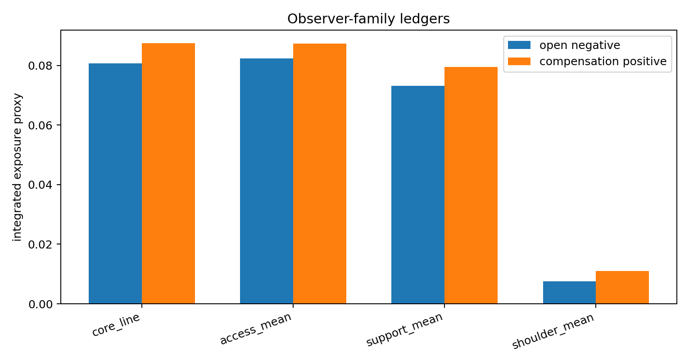
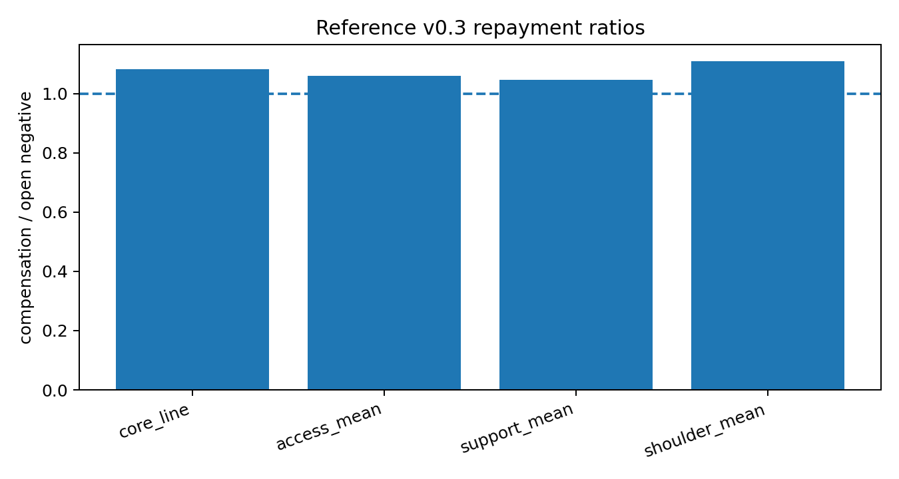
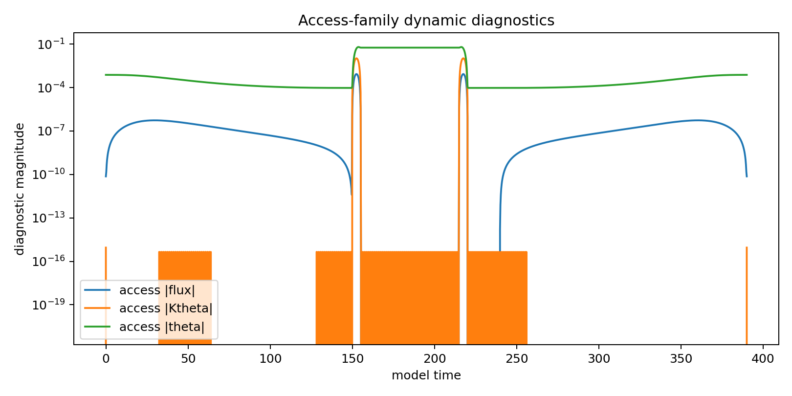
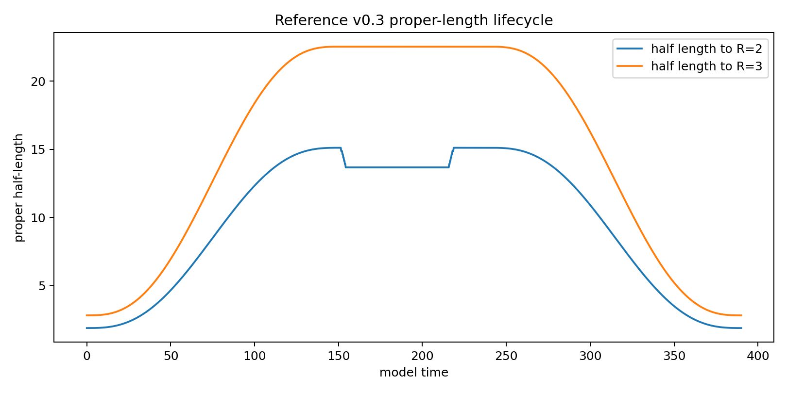
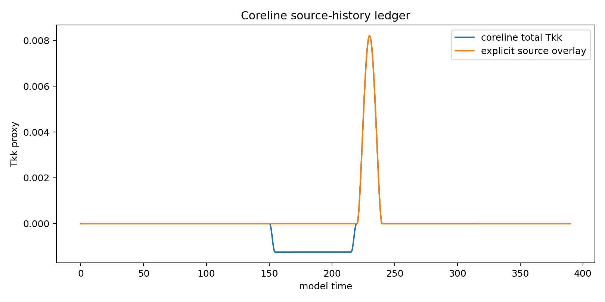

# Executive summary

This report freezes the canonical geometry for the **reference compensated flare-gated radial-stretch design**.  The design is a reduced prescribed-geometry engineering candidate for a traversable-wormhole support plant under the conditional assumption that a source capable of controlled null-energy violation can be supplied.  The contribution is geometry-control architecture: a lifecycle that assigns radial stretch, flare access, lapse shaping, repayment, and shoulder buffering to distinct functions and tests each function with observer-family ledgers.

The canonical design is **Reference Geometry v0.3**:

```text
flattened R standby
-> B prestretch
-> R flare opening
-> quiet access hold
-> R closure
-> balanced support/shoulder compensation with N shaping
-> B reset
```

The frozen parameter set is:

| Parameter | Value |
|---|---:|
| B0 | 8.0 |
| wB | 10.0 |
| T_B | 150.0 |
| T_R | 5.0 |
| T_H | 60.0 |
| T_C | 20.0 |
| R standby core radius Rc | 1.0 |
| R-flattening width | 1.6 |
| support compensation amplitude | 0.0082 |
| support compensation width | 0.9 |
| shoulder compensation amplitude | 0.0019 |
| shoulder compensation center | 2.3 |
| shoulder compensation width | 1.0 |
| shoulder lapse amplitude | -0.18 |
| shoulder lapse center | 2.3 |
| shoulder lapse width | 1.0 |

The reference passes the current reduced geometry screen.  The open interval carries a controlled negative null-contracted support ledger.  The compensation phase supplies positive source exposure after flare closure.  The access observer family remains isolated during compensation.  The shoulder subsystem contains the lapse and compensation shaping while maintaining bounded areal radius and bounded lapse.

Key v0.3 ledgers:

| Ledger | Open negative | Compensation positive | Ratio |
|---|---:|---:|---:|
| core line | 0.080748 | 0.087465 | 1.083 |
| support mean | 0.073111 | 0.076496 | 1.046 |
| shoulder mean | 0.007474 | 0.008291 | 1.109 |

Access-family isolation during compensation is strong in the reduced packet:

| Diagnostic | Value |
|---|---:|
| access max absolute flux | 9.480e-07 |
| access max abs Kll | 4.378e-09 |
| access max abs Ktheta | 1.161e-05 |
| access max abs theta | 1.172e-04 |
| access minimum N | 1.000000 |
| access minimum R | 1.000000 |

The canonical geometry is ready for the next stage: source-realism screening, quantum-inequality comparison, matching analysis, and backreaction/stability assessment.

# 1. Literature context

The design sits inside the standard traversable-wormhole constraint landscape.  Morris and Thorne established the traversable throat construction, finite redshift requirements, traversability constraints, and exotic-stress requirement at the throat [@MorrisThorne1988].  Ford and Roman applied quantum-inequality reasoning to static wormhole geometries and showed that sampled negative energy strongly constrains macroscopic throats [@FordRoman1996].  Their quantum-interest work gives repayment a structured temporal meaning: negative-energy pulses are paired with compensating positive-energy pulses whose timing and magnitude matter [@FordRoman1999].

Visser, Kar, and Dadhich developed volume-integral quantifiers that separate local energy-condition violation from total integrated burden [@VisserKarDadhich2003].  Kar, Dadhich, and Visser further developed the quantification of energy-condition violations with volume integrals [@KarDadhichVisser2004].  Fewster and Roman supplied a decisive null-contracted sampling test for small-exotic-matter wormhole models by averaging null-contracted stress-energy over timelike worldlines [@FewsterRoman2005].  Hochberg and Visser established local dynamic-throat diagnostics with null expansions and energy-condition analysis for time-dependent throats [@HochbergVisser1998PRL; @HochbergVisser1998PRD].

Recent theoretical work supplies constructive traversability examples in special quantum-gravity settings.  Gao, Jafferis, and Wall showed that a double-trace coupling between the boundaries of an eternal BTZ black hole can create negative average null energy and make the bridge traversable in the AdS/CFT setting [@GaoJafferisWall2017].  More recent worldsheet traversable-wormhole work develops related double-trace deformation ideas in string/AdS settings [@DeBoerEtAl2023].  Those papers provide source-side and quantum-information context.  The present report focuses on a semiclassical engineering geometry screen, with source construction assigned to the next gate.

Engineering-adjacent exotic-spacetime analysis also motivates metric-function decomposition.  Bobrick and Martire treat warp-drive metrics through separable design roles and physical conditions [@BobrickMartire2021].  The present design applies a related engineering mindset to wormhole-support infrastructure: define subsystem roles, assign metric/source controls to those roles, then evaluate observer-family exposure ledgers.

# 2. Framework alignment

The underlying screening framework decomposes a proposed wormhole-support system into seven functions:

```text
support, access, repayment, buffer, matching, transition, source realism
```

Reference Geometry v0.3 realizes those functions as follows:

| Function | Control in v0.3 | Geometry role |
|---|---|---|
| Support | B(l,t) stretch during prepared state | radial proper-length support dilution |
| Access | R(l,t) flare state during hold | active areal throat and quiet access geometry |
| Repayment | explicit positive null-contracted source overlay | post-closure compensation carrier |
| Buffer | shoulder R/N/source windows | spatial containment of repayment and transition activity |
| Matching | shoulder lapse N(l,t) | redshift/timing/matching shape during compensation |
| Transition | R-flare open/close and shoulder windows | controlled movement between standby and access geometry |
| Source realism | external next-stage model | quantum state, effective source, or modified-gravity realization |

The design uses the metric family

$$
ds^2 = -N(l,t)^2 dt^2 + B(l,t)^2 dl^2 + R(l,t)^2 d\Omega^2.
$$

The engineering allocation is:

```text
B(l,t): radial support dilution
R(l,t): flare/access-state gating
N(l,t): timing, redshift, matching, and isolation
explicit Tkk source overlay: repayment carrier
shoulder windows: buffer and transition containment
```

This allocation follows the screening sequence discovered during development.  The B-only protocol produced clean radial-stretch dynamics and a persistent source-history burden.  The B,R pair added a flare/access-state gate.  The B,R,N plus explicit source branch added a balanced compensation phase and kept the access family isolated after closure.  The final v0.3 geometry combines those roles into one lifecycle.

# 3. Canonical geometry definition

## 3.1 Time phases

Reference v0.3 uses these phase boundaries:

| Phase | Time interval |
|---|---:|
| B setup | 0 to 150.0 |
| R open | 150.0 to 155.0 |
| hold | 155.0 to 215.0 |
| R close | 215.0 to 220.0 |
| compensation | 220.0 to 240.0 |
| B reset | 240.0 to 390.0 |

The phase order is the main design result.  B prestretch occurs while the flare is flattened.  R opens the access flare after the radial proper-length infrastructure is prepared.  The access hold uses a quiet B/R/N configuration.  R closure ends active access before compensation.  Explicit support/shoulder source terms deliver repayment during the compensation phase.  B reset returns the radial infrastructure after the compensation ledger is established.

## 3.2 Radial support-dilution control B

The B sector uses a smooth localized stretch window:

$$
B(l,t)=1+(B_0-1) A_B(t) F_B(l),
$$

with B0 = 8.0 and wB = 10.0.  The lifecycle ramps B during setup, holds the stretch through access and compensation, and resets B after compensation.  This preserves the useful B-sector role found earlier: local support dilution through proper radial length.

The hold midpoint proper half-lengths are:

| Quantity | Value |
|---|---:|
| half-length to R=2 | 13.678 |
| half-length to R=3 | 22.535 |
| standby preopen half-length to R=2 | 15.117 |

## 3.3 Flare/access-state control R

The R sector uses a flattened standby profile and an access flare profile.  The active access profile is the simple reference flare

$$
R_access(l)=\sqrt{1+l^2}.
$$

The standby profile preserves the core radius Rc = 1.0 and flattens the near-core flare curvature over width wFlat = 1.6.  The R open phase restores the active flare.  The R close phase restores the flattened standby profile.  This gives R a positive role as the access-state and flare-curvature actuator.

This R role is the core refinement beyond the B-only protocol.  B supplies radial support dilution.  R supplies active flare state.  The pairing allows long B preparation/reset intervals to occur while the active flare is closed.

## 3.4 Lapse/matching control N

The N sector is active during compensation in the shoulder region:

$$
N(l,t)=1+A_N C(t) W_N(l),
$$

with A_N = -0.18, center 2.3, and width 1.0.  This lapse shaping gives the compensation phase a bounded matching/redshift profile.  In v0.3 the full-cycle minimum lapse is 0.820036, and the shoulder compensation minimum lapse is 0.820036.

## 3.5 Explicit positive source overlay

The explicit compensation overlay is represented as a positive null-contracted source term during the compensation phase:

$$
Tkk_src^+(l,t) = C(t) [ A_s W_s(l) + A_h W_h(l) ].
$$

The support component uses amplitude 0.0082 and width 0.9.  The shoulder component uses amplitude 0.0019, center 2.3, and width 1.0.  The overlay is an engineering ledger term at this stage.  A physical quantum state, effective field theory source, boundary effect, or modified-gravity branch remains the source-realism gate.

# 4. Diagnostic method

The code evaluates reduced effective Einstein-source proxies for the metric family and adds the explicit positive Tkk overlay during compensation.  The diagnostic packet records:

- null-contracted stress histories Tkk_plus and Tkk_minus;
- the minimum radial null-contracted stress proxy Tkk_min;
- access, support, shoulder, and matching observer-family ledgers;
- flux proxy T_hat_tl;
- extrinsic-rate proxies K^l_l and K^theta_theta;
- null expansions theta_plus and theta_minus;
- lapse and areal-radius bounds;
- proper radial lengths;
- derivative/transition proxies including dlogB/dl, dlogN/dl, R_l, R_ll, R_t, and R_tt.

The observer-family gates are evaluated by phase.  The open interval combines R open, hold, and R close.  The compensation interval follows R closure.  The primary geometry closure tests are:

1. compensation ratios above unity for core, support, and shoulder ledgers;
2. bounded access flux and expansion activity during the open interval;
3. extremely small access leakage during compensation;
4. bounded lapse and bounded areal radius in shoulder and matching regions;
5. shoulder transition quantities retained in a controlled budget.

# 5. Results

## 5.1 Source-history ledgers

The v0.3 observer-family ledgers are balanced:

| Ledger | Open negative | Compensation positive | Ratio |
|---|---:|---:|---:|
| core line | 0.080748 | 0.087465 | 1.083 |
| support mean | 0.073111 | 0.076496 | 1.046 |
| shoulder mean | 0.007474 | 0.008291 | 1.109 |

The design provides a compact compensation margin.  The ratios sit close to unity with positive margin.  The shoulder overcompensation present in earlier v0.1/v0.2 variants has been removed.





## 5.2 Access open-interval dynamics

During R-open/hold/R-close, the access diagnostics are:

| Diagnostic | Value |
|---|---:|
| max absolute flux | 8.490e-04 |
| max abs Kll | 4.378e-09 |
| max abs Ktheta | 1.040e-02 |
| max abs theta | 6.259e-02 |
| minimum N | 1.000000 |
| minimum R | 1.000000 |

The open-interval access dynamics are dominated by the deliberate R flare gate through K^theta_theta.  The B sector is effectively static during the active access interval.  The lapse remains unity in the access core.



## 5.3 Access isolation during compensation

During compensation, access-family diagnostics are:

| Diagnostic | Value |
|---|---:|
| max absolute flux | 9.480e-07 |
| max abs Kll | 4.378e-09 |
| max abs Ktheta | 1.161e-05 |
| max abs theta | 1.172e-04 |
| minimum N | 1.000000 |
| minimum R | 1.000000 |

This is the strongest engineering result in the canonical geometry.  The compensation phase delivers positive source exposure after R closure while leaving the access observer family essentially quiet in the reduced diagnostics.

## 5.4 Shoulder and matching bounds

During compensation the shoulder subsystem records:

| Diagnostic | Value |
|---|---:|
| shoulder max absolute flux | 1.374e-06 |
| shoulder max abs Kll | 4.378e-09 |
| shoulder max abs Ktheta | 1.440e-04 |
| shoulder max abs theta | 2.167e-01 |
| shoulder minimum N | 0.820036 |
| shoulder minimum R | 1.172512 |
| shoulder max abs dlogN_dl | 0.300 |
| shoulder max abs Rll | 1.987 |

The shoulder acts as the compensation container and matching subsystem.  It carries the active lapse shaping and source overlay while maintaining bounded geometry.

## 5.5 Global geometry bounds

The full lifecycle bounds are:

| Bound | Value |
|---|---:|
| full-cycle N_min | 0.820036 |
| full-cycle R_min | 1.000000 |
| full-cycle B_max | 8.000 |
| max abs dlogB_dl | 0.334 |
| max abs dlogN_dl | 0.300 |
| max abs Rll | 1.987 |
| max abs Rtt | 0.093 |





# 6. Development history and design rationale

The finalized geometry follows a sequence of constructive screens.

## 6.1 B-only radial stretch

The first strong control was radial proper-length stretch through $B(l,t)$.  B stretching reduced local peak support severity and produced clean adiabatic rate scaling in setup/reset ramps.  The source-history screen showed that a B-only protocol carries a persistent active throat when $R(l,t)$ remains fixed as $\sqrt{1+l^2}$.  That finding assigned B to radial support dilution and sent active access-state control to R.

## 6.2 B,R flare-gated radial stretch

The B,R branch introduced a flattened standby R profile and restored the flare only for the useful access interval.  The best sequence was B prestretch followed by R flare opening.  This allowed long B setup/reset phases to occur with the flare flattened.  The design rule became:

```text
stretch first, open flare second, close before compensation.
```

## 6.3 B,R,N plus explicit compensation

The compensation branch assigned repayment to an explicit positive null-contracted source overlay and assigned shoulder R/N to buffer and matching roles.  Shoulder R/N shaping improved containment.  The explicit source overlay carried the repayment ledger.  The v0.3 polish pass balanced core, support, and shoulder ratios while preserving access isolation.

# 7. Interpretation against the literature

Reference v0.3 aligns with the conservative wormhole-physics picture.  It treats flare-out support as a null-contracted support problem.  It treats peak stress, integrated exposure, and sampled histories as separate gates.  It treats repayment as a timed source-history task.  It treats dynamic R activity through null-expansion and access-quietness diagnostics.

The geometry offers a concrete operational decomposition under the conditional construction assumption:

```text
B supplies support dilution.
R supplies access-state/flare gating.
N supplies matching and redshift shaping.
Explicit positive source overlays supply repayment ledgers.
Shoulders supply buffer and transition containment.
```

This decomposition supports the engineering framework and prepares a source-realism handoff.  The design contributes an engineering lifecycle rather than a source-side theorem.  The source-realism gate remains the decisive physics stage: a candidate quantum state, boundary configuration, semiclassical stress tensor, or effective-matter model must realize the positive and negative null-contracted histories within known quantum-inequality and backreaction constraints.

# 8. Canonical status

Reference Geometry v0.3 is frozen as the canonical geometry for the current engineering phase.

The geometry closure status is:

| Gate | Status |
|---|---|
| B support-dilution lifecycle | passes current reduced packet |
| R flare/access-state gate | passes current reduced packet |
| quiet hold geometry | passes current reduced packet |
| post-closure compensation isolation | passes current reduced packet |
| support compensation ratio | passes current reduced packet |
| shoulder compensation ratio | passes current reduced packet |
| lapse and radius bounds | passes current reduced packet |
| invariant/proxy diagnostic packet | passes current reduced packet |
| source realism | next-stage gate |
| backreaction and stability | next-stage gate |
| exterior/topology matching | next-stage gate |

# 9. Next-stage handoff

The geometry handoff package gives source-realism work a specific target:

1. reproduce the v0.3 Tkk_geo and Tkk_src ledgers with a candidate physical source;
2. evaluate timelike-worldline sampling and null-contracted QI-style bounds for core, support, shoulder, and matching observer families;
3. test quantum-interest structure for the compensation timing;
4. replace the explicit positive source overlay with a field/state/boundary model;
5. evaluate semiclassical backreaction and ringing through at least a perturbative evolution screen;
6. refine exterior matching and repeated-cycle accounting.

The geometry result supplies a well-defined reference target for those gates.

# 10. Files in this bundle

The bundle contains:

```text
report/canonical_geometry_report.md
report/canonical_geometry_report.pdf
report/references.bib
report/report_progress_notes.md
scripts/run_reference_polish_screen.py
scripts/run_TR_polish_comparison.py
scripts/run_invariant_packet_v03.py
data/*.csv
data/*.json
figures/*.png
lineage/*
manifest.json
README.md
```

# References
